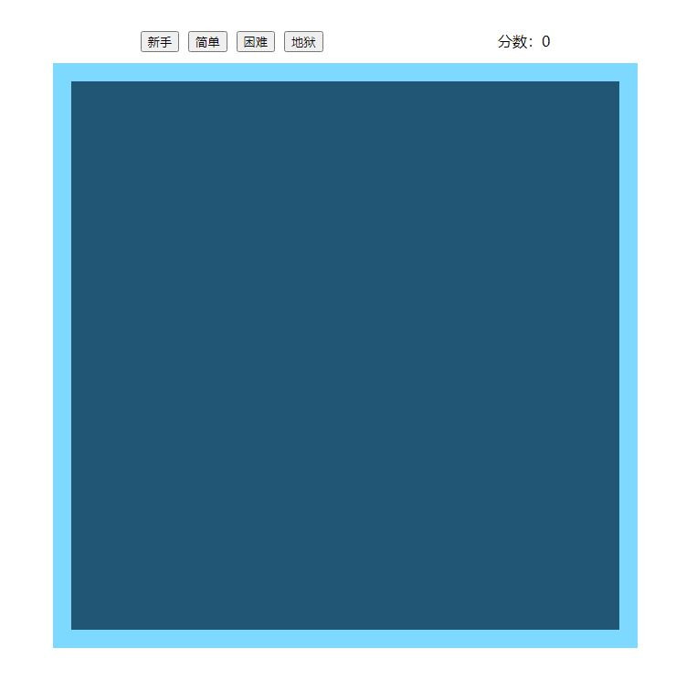
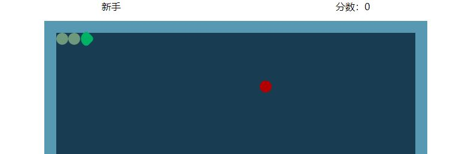
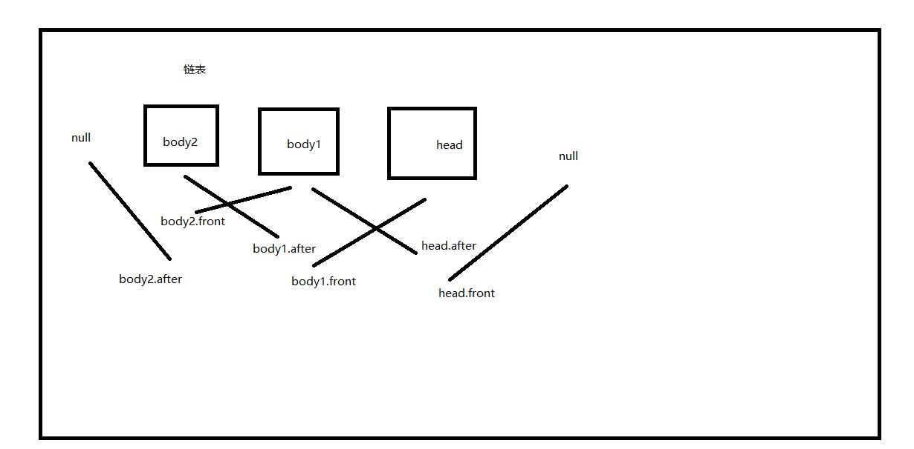
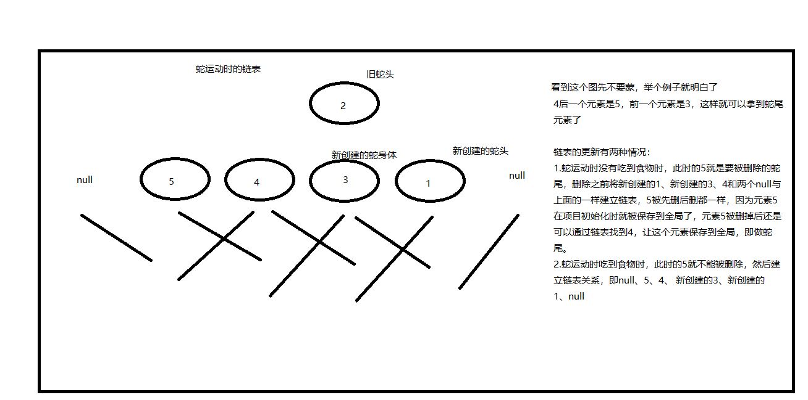

# 经典游戏-贪食蛇（二维数组坐标）

### 以前有写过一个简易版的，但也只是简单的实现了，索引的方式虽然逻辑简单，但太费性能，功能也很少，老有莫名其妙就撞到自己的BUG。所以用不同的方式又写了个版本。

### 上图

## 一、更新：

- #### 用二维数组的方式绘制地图
- #### 进入开始游戏前新加了游戏难度选择按钮
- #### 实时显示得分
- #### 对频繁按下方向控制按钮进行节流
- #### 游戏结束自动初始页面
- #### 新加游戏开始、暂停按钮

## 二、项目技术栈：

- ### 以 ES6 语法结合面向对象思想进行开发

## 三、项目主要思路以及后期的一些优化：

- ### 基本空间坐标框架

  - #### 首先定义游戏地图空间左顶点的 left、top 的像素值为原点并分别换算为行和列的坐标，在地图中只存在蛇的每节身体和食物的元素，每个元素都记录下当前时刻像素值转换为行和列的坐标，以图为例：（蛇的像素坐标值分别为[[0 ,0], [20, 0], [40, 0]],为了方便计算除以方块的宽高得到[[0, 0], [1, 0], [2, 0]])
    

- ### 蛇的运动

  - #### 要说明的是蛇的运动并不是整体移动，而是只要在旧蛇头下一次运动的位置创建一个新蛇头，然后删除原蛇头元素并创建一个蛇身体，再把蛇尾的元素删除，并且实时更新每个元素的坐标，如此操作看起来就像是整体在移动。但删除蛇尾不是那么容易获取到每个时刻的蛇尾元素，一般这里都是采用最简单的链表的方式来保存元素来进行操作。如果吃到食物，那就不用删除蛇尾。

- ### 检测蛇的碰撞

  - #### 检测对墙壁的碰撞只要检测新创建的蛇头是否越界就可以了，但对蛇身的碰撞检测就没有这么简单了，不仅要让新蛇头对蛇身所有坐标进行检测，还要进行对键盘事件进行防抖，否则频繁乱按会很容易撞到蛇头的后一个蛇身体。

- ### 食物的生成

  - #### 取随机数坐标，这个随机数坐标不能越界，而且不能生成在蛇身上。

- ### 蛇的链表更新和链表更新图解
  
  
- ### 后期优化
  - #### 单局游戏结束后自动初始到重新开始游戏的页面。
  - #### 新加入选择游戏难度按钮，且单局中只能选择一次，实时显示游戏得分。
  - #### 对频繁按下方向控制按钮进行节流处理。

## 四、代码实现
- ### 定义创建方块的对象

  - #### 因为蛇的每节身体和食物都是方块，所以这个对象要记录下这个方块的像素坐标、calss类名和方块元素的父级。

  - #### 还需要有创建并把元素插入到页面和移除页面元素的方法

- ### 定义蛇的对象

  - #### 需要记录下蛇头和蛇尾的元素、每节蛇身的坐标以及保存蛇每走一格的坐标的位移量，（可理解为旧蛇头的坐标加上保存的位移量就得到了新蛇头的坐标）。

  - #### 初始蛇方法：用创建方块的实例在页面中创建一条初始的蛇，保存蛇头和蛇尾元素，记录下这条蛇的所有坐标，并给蛇的每节身体建立链表，然后给蛇一个默认移动方向

  - #### 获取蛇头下一个坐标来检测是否与墙壁、自身、食物碰撞，然后根据各种情况区分别调用各种方法的方法

  - #### 正常移动方法：在旧蛇头的位置创建一个新蛇头，然后移除旧蛇头，再在旧蛇头的位置创建一个蛇身体然后删除旧蛇尾，更新链表关系、蛇的所有坐标、蛇头和蛇尾元素。

  - #### 吃的方法：就是蛇头与食物碰撞，与上一个正常移动的方法差不多，只是少了删除蛇尾操作。然后调用重新创建一个食物并让游戏得分更新。

  - #### 死亡的方法：蛇头撞到墙或自身，去调用游戏实例的结束游戏的方法

- ### 定义创建食物的方法
  - #### 在游戏地图里随机生成一个坐标，然后用该坐标与当前时刻保存的蛇得所有进行遍历比对，如果没找到就让食物元素闪现到随机生成的坐标位置上（并不用再创建一个食物元素，食物在初始化游戏时就创建了）。

- ### 游戏逻辑的对象

  - #### 初始化游戏的方法：初始化一条蛇并创建一个食物，然后给键盘绑定事件并对事件进行节流

  - #### 开始游戏的方法：设置一个定时器，让他每隔一段时间执行一次实例化的蛇的正常与懂得方法。

  - #### 游戏结束的方法：线让蛇停止运动，然后弹出得分，再让页面回到游戏初始的状态。

  - #### 定义游戏难度的方法：給难度选择按钮绑定事件，根据每个按钮的文本来修改start里的定时器的时间，从而达到修改游戏难度的目的

